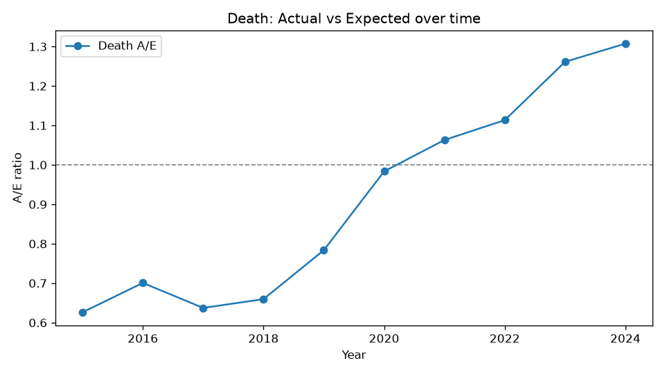
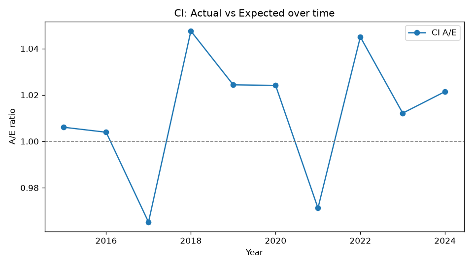
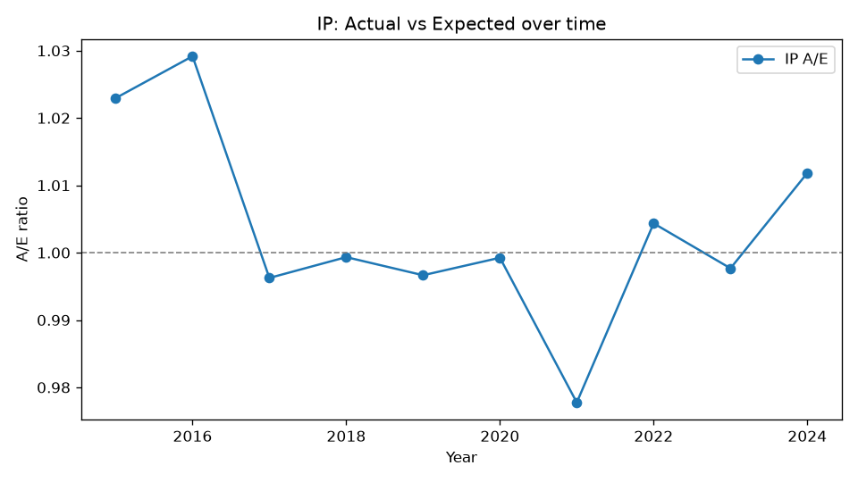
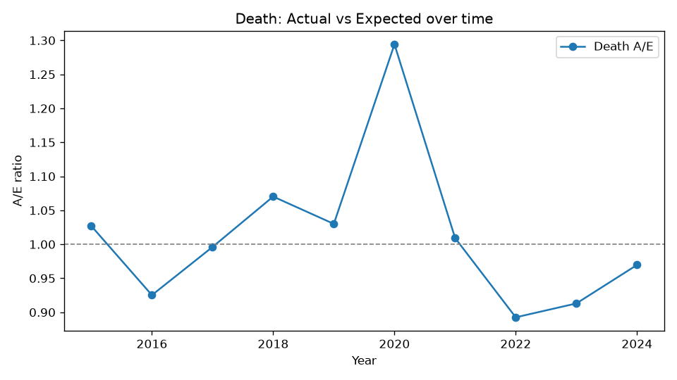
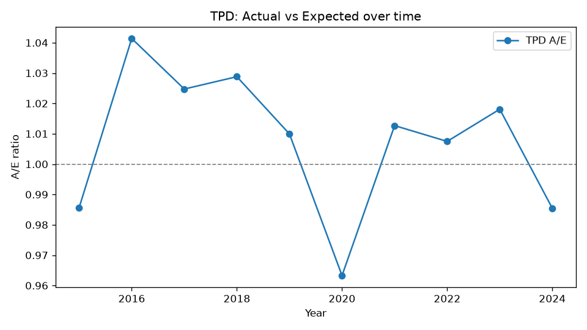
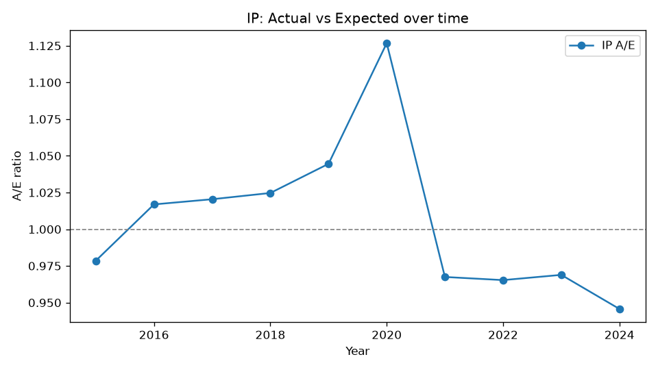

# ⚖️ Life Insurance Experience Bench

**A framework for generating life-insurance experience data, testing an LLM on it, and
measuring what it finds.** The data is life-insurance experience measured as actual over
expected (A/E).

| if you want | go to |
|---|---|
| the findings from using this framework — what it shows about the need for harness evolution as a model's characteristics change | [docs/REPORT_qwen36_vs_qwen38.md](docs/REPORT_qwen36_vs_qwen38.md) |
| the platform itself, and how to replicate the experiment | [docs/EXPERIMENT_INDEX.md](docs/EXPERIMENT_INDEX.md) |
| how to generate the data yourself | [Where the data comes from](#-where-the-data-comes-from-and-how-to-generate-it-yourself) |

---

## 1 · The data: A/E tables, charts, and the insight inside them

A **scenario** is one synthetic portfolio: 250 000 policies, four benefit lines — Death, CI, TPD,
IP — and their actual-versus-expected (A/E) numbers by year, 2015–2024. A/E is actual claims ÷
expected claims.

Both examples below are real scenarios in this repo. The model is fed text only; the charts here
are for illustration.

### What the model is fed

One folder per scenario, `data/eval/<split>/<sc-id>/`. This is what reaches the model:

- `artifacts/ae_<benefit>_by_year.csv` — the four yearly series, i.e. the charts below:
  **inlined in the prompt**, ten rows each, e.g. `2018: Actual=257 Expected=389.6 AE=0.660`
- `artifacts/summary.json` — overall A/E and claim counts per line: **inlined**
- `artifacts/ae_ip_termination.csv` — IP recovery A/E by diagnosis: **inlined**
- `artifacts/ae_<benefit>.csv`, `ae_<benefit>_age_gender.csv` — the same A/E at age × gender × year
  grain: listed by path, read with a sandboxed python call if the model wants it
- `artifacts/*.png` — the charts on this page: listed by path, of no use to a text-only model
- `<benefit>_claims.csv`, `exposure.csv`, `benchmarks/<benefit>.csv` — the raw claims and exposure
  behind every ratio: listed by path, **not published** in the clone (regenerable; see
  [What ships](#-what-ships-in-a-clone-and-what-you-regenerate))

That is the whole feed: about 130 numbers plus a file list — roughly **2.7k prompt tokens** bare,
and about **6.6k** once the evidence pack of section 2 is added. Every finer grain is on disk and
one tool call away. A full prompt exactly as it was sent, for the complex scenario below:
[`results/harness_final/zero_shot/sc-c9d78b_prompt.md`](results/harness_final/zero_shot/sc-c9d78b_prompt.md).

### The simple case: `sc-f69eea` — one line, one movement

| **Death** | **CI** |
|---|---|
|  |  |
| **TPD** | **IP** |
|  |  |

**The truth, and the only finding in this scenario:**

- **Death is deteriorating and has not stopped.** A/E climbs in every year from 2018 (0.66) to
  2024 (1.31), ending 31 % above expected. The published manifest
  `data/truth/manifests/sc-f69eea.json` says drift of **+0.15/yr on Death, 2018–2024**.
- **The other three lines are flat** — CI within 0.96–1.05, TPD within 0.96–1.04, IP within
  0.98–1.03, across all ten years. One line moving while its neighbours do not rules out a
  portfolio-wide cause: not a claims-reporting change, not a population shift, not a macro shock.
- **The insight:** a line-specific frequency trend on Death, so refer that line to pricing and
  reserving and leave CI, TPD and IP as priced. "Death A/E rose" is a description; the line, the
  years, the pattern and the action together are the finding.

Every harnessed configuration saturates on scenarios like this one, and on `recovery` and
`volatility`, so the interesting results come from the hard ones.

### The complex case: `sc-c9d78b` — four findings in one scenario

`sys_cascade_drift_shock_2018`, held-out split:

| **Death** | **CI** |
|---|---|
|  |  |
| **TPD** | **IP** |
|  |  |

**The truth: four planted findings, on two lines, of two different kinds.**

| planted | window | size |
|---|---|---|
| Death drift | 2016–2019 | +0.05/yr |
| IP drift | 2016–2019 | +0.03/yr |
| Death shock | 2020 | ×1.3 |
| IP shock | 2020 | ×1.2 |
| CI and TPD | — | untouched, a check on the rest |

**Why it is hard.** Only the 2020 Death shock is visible to the eye, at 1.294. The 2016–2019
Death drift wanders 0.925 → 0.996 → 1.070 → 1.030 and then reverts, and its slope (+0.05/yr) is
about the size of the year-to-year Poisson noise on that line (±0.045 at these claim counts). IP
is the same problem one step smaller: +0.03/yr against ±0.026. This is what a marginal experience
movement looks like, and it is a hard call even holding the answer key.

**What actually happened.** Four units per run, three runs, each model on its own tuned harness —
and **both finished on exactly 6 of 12**, by different routes
(`results/harness_final/scores.json`, `results/harness_q36_final/scores.json`):

| planted finding | reported in |
|---|---|
| Death shock 2020 | **6 of 6 runs** — every run of both models |
| IP drift 2016–19 | 4 of 6, each time with a window so wide it only counted because it overlapped |
| IP shock 2020 | 2 of 6 |
| Death drift 2016–19 | **0 of 6** — three runs said nothing, three pointed at 2022–2024, which is a different movement |

The loud event is always found and the quiet one is not, and neither model holds four findings in
one answer. Missing is not the only failure: Qwen3.8's run 3 offered five findings, three of them
false — the 2022–2024 Death "drift", plus two volatility claims covering the post-shock give-back,
where nothing was planted.

The hardest version of this pattern is `sc-73fd27`: three parallel drifts (+0.05, +0.03 and
+0.02/yr on Death, CI and IP), all confined to 2016–2019 and all reverting afterwards, TPD flat.
**Both models scored 0 of 9 there**, with 8 and 10 false alarms between them. Scenarios like these,
not the simple ones, are what the harness work below was chasing.

### What the model has to return

One JSON object per scenario. The shape, verified against the pinned prompt
(`data/prompts/system_v2_baseline.txt`):

```json
{"scenario_id": "sc-f69eea",
 "overall_assessment": "anomalies",
 "findings": [{
   "benefit": "Death",
   "years": [2018, 2024],
   "pattern": "drift",
   "direction": "increase",
   "magnitude": "+0.15/yr, A/E 0.66 -> 1.31",
   "confidence": 0.9,
   "evidence": ["ae_death_by_year.csv: monotone rise 2018-2024, CI unchanged"],
   "recommended_action": "refer Death claim frequency to pricing and reserving"}]}
```

`pattern` is one of `drift | shock | volatility | recovery | other`, `direction` is one of
`increase | decrease | dispersion`. A clean scenario requires `overall_assessment: "clean"` and
an empty `findings` list; claiming anything on a clean scenario is a false alarm. Scoring is
strict: benefit, pattern, window and direction must all agree.

---

## 2 · Two ways to ask a model: the model alone, or the model with a harness

The same book is put to the model in two configurations. Nothing differs between them except
the harness — same model, same endpoint, same sampler, one turn.

**A — the model alone (`--harness off`).** A system prompt giving the role, the A/E
definition, the pattern taxonomy and the JSON contract; the list of files in the scenario
folder; and the CSVs on disk. The model reads tables and answers.

**B — the model with a harness (`--harness full --tool-calls 4`).** All of A, plus three
things:

1. **A computed evidence pack.** Deterministic statistics for every benefit line, generated
   from the CSVs by [`scripts/stats_pack.py`](scripts/stats_pack.py) before the model is
   called, and appended to the prompt. A real block, from a published prompt
   (`results/harness_final/zero_shot/sc-0ce4d6_prompt.md`). The book is a CI volatility case and
   the pack is what tells drift from scatter — that line moved +0.44 in level in 2022–23 and the
   pack still calls the line scatter-dominated:

   ```text
   [CI] mean A/E 0.975 | evidence profile: scatter-dominant: the largest single-year move
        exceeds the net level change ... Poisson z-scores are INVALID here
     trend: gradient 0.0275/yr, R2 0.19, total 0.247
     step:  +0.292 at 2022 (score 1.9)
     excursions (windows whose level differs from the rest, best first): 2022-2023 (2y) +0.436 score 4.9
     YoY sd: empirical 0.2435 vs Poisson 0.0305 -> overdispersion x7.97 (Poisson null INVALID on this line)
     onset: max 1yr move / excursion size = 1.22 (the whole excursion arrives in ONE year, then holds)
     yearly: 2021:0.88(z-4.4) 2022:1.41(z+16.2) 2023:1.24(z+9.8) 2024:0.89(z-4.7)
   ```

   Plus a reading guide that says what does *not* count: mild overdispersion is the normal
   texture of these books, and tiny age or duration cells are unreliable however extreme
   their A/E looks.
2. **Discipline rules.** Where the taxonomy gets explicit — for example, that a trend which
   reverts at the end is still drift, and that a one-year spike inside a swinging line is
   volatility rather than drift.
3. **Up to four sandboxed python calls.** "You are not limited to eyeballing the tables":
   the model can run its own calculations over the `artifacts/` folder. Execution is
   `python -I -c`, 10 s timeout, 4 000-char output, working directory set to the book. That
   is a guardrail, **not a jail**: there is no network block and no filesystem confinement,
   so treat it as advisory (see **Sandbox** below).

```bash
python3 scripts/stats_pack.py data/eval/optimization/sc-f69eea --text      # just the pack
python3 scripts/run_zero_shot.py --scenarios sc-f69eea --harness off       # A
python3 scripts/run_zero_shot.py --scenarios sc-f69eea --harness full --tool-calls 4   # B
python3 scripts/score_xam.py results/<corpus>/zero_shot                    # score either
```

Both configurations are run over the same books on purpose: **B − A is the measured value of
the harness**, which is the number this repo exists to publish. Every run records the full
prompt it was given, and every corpus snapshots the harness code and prompt bytes that
produced it (`results/<corpus>/harness_snapshot/`), so a comparison can be audited instead
of trusted.

---

## 3 · How the answers are measured: accuracy, false alarms, precision, tokens, time

A **unit** is one planted control in one run. A control planted across a whole book counts
as four units, one per benefit line. A unit is a **hit** only if benefit, pattern, window and
direction all agree with the manifest. A **claim that counts** is a finding that was either a
hit or a false alarm; duplicate findings are ignored both ways.

| metric | formula | the question it answers |
|---|---|---|
| **accuracy** (strict recall) | strict hits ÷ units | did it find what was there? |
| **FP/claim** | false alarms ÷ claims that counted | when it spoke, how often was it wrong? |
| **precision** | hits ÷ claims = 1 − FP/claim | the same thing, phrased the other way |
| **tokens** | prompt + completion, from the API `usage` field | what one answer consumes |
| **wall time** | per run, request sent to answer complete | what one answer costs in time |

Accuracy and FP/claim have different denominators. Within the units ledger, accuracy +
miss-rate = 100 %. Within the findings ledger, precision + FP/claim = 100 %. Reporting only
one of them hides half of what happens, and the two subjects fail in opposite directions.

### Worked example: 3.8 with its own harness

Held-out split, 23 books × 3 runs, `sc-e6ffa4` excluded from every cell (it never completed
under one configuration; see INDEX §8). Numbers from
`results/harness_final/scores.json` and the per-run records:

| step | value |
|---|---|
| units | 111 |
| strict hits | 79 |
| false alarms | 57 |
| claims that counted | 79 + 57 = 136 |
| **accuracy** | 79 ÷ 111 = **71.2 %** |
| **FP/claim** | 57 ÷ 136 = **41.9 %** |
| **precision** | 79 ÷ 136 = **58.1 %** |
| median tokens per answer | 6 714 prompt + 13 763 completion |
| median wall time per answer | 813 s ≈ 13 min 33 s |

The same ledger for Qwen3.6 with its own harness (`results/harness_q36_final/`): 73 hits, 46
false alarms, 119 claims → **accuracy 65.8 %, FP/claim 38.7 %, precision 61.3 %**, median
6 603 + 5 779 tokens, 289 s ≈ 4 min 49 s per answer.

Read the two together and the point appears. 3.6 finds less but is more trustworthy when it
speaks; 3.8 finds more and talks far too much. Accuracy alone ranks 3.8 first; precision
reverses that.

### Cost, next to the score

One 72-call held-out exam, measured over the whole published corpora including retries:

| configuration | tokens | wall clock | accuracy | precision |
|---|---|---|---|---|
| 3.6 + its own harness | 0.89 M | 5.9 h | 65.8 % | 61.3 % |
| 3.8 + its own harness | 1.95 M | 21.9 h | 71.2 % | 58.1 % |

Accuracy and precision are the 23-book cells from above. The token and wall-clock totals are
every call actually made in those two corpora, all 72 of them, retries included — which is
why 21.9 h is more than the median per answer multiplied out.

At the median per answer rather than the corpus total the same comparison is about **6 hours
versus about 16 hours** — 3.6 reaching roughly 93 % of 3.8's accuracy for about a third of
the time and tokens, at better precision. Cost is reported beside accuracy everywhere in
this repo because it changes the ranking, not because it is a footnote.

---

## 🔍 The Study Behind It — Four Questions This Has to Answer

Sections 1–3 explain how the platform works. This section is what the two model campaigns
were run for, and what they settled.

### Governance — what someone signing this off actually needs

Suppose you want an LLM to help with experience studies: reading A/E tables, flagging
lines that need investigation, drafting experience commentary. Before you can rely on it,
someone has to be able to answer four questions. One convincing demo answers none of them.

| the question | how this repo answers it | the answer |
|---|---|---|
| **How good is the model?** | A generated answer key that cannot change after the exam (`data/truth/seal.json`). A held-out split, mounted and scored **once**. Strict matching, so a vague or mislabelled answer scores nothing. | Accuracy: 3.8 **71.2 %**, 3.6 **65.8 %**. Precision tells the opposite story, which is why both are headline numbers. |
| **What does it miss, and what does it invent?** | Two separate metrics, never blended: accuracy (found ÷ what was there) and FP/claim (wrong ÷ what it said). | They fail in opposite directions. 3.8 invents: **34.3 %** precision with no harness. 3.6 is cautious: already **60.0 %** precise. |
| **What does it cost?** | Wall clock, reasoning volume and completion tokens are recorded on every run and reported beside the score. | **About 3× apart.** Per answer: 3.6 ≈ 4.8 min and 5.7k completion tokens, 3.8 ≈ 13.5 min and 13.8k. Worked through in section 3. |
| **Is the pipeline around it right, or does it need updating — and on what evidence?** | Every corpus stores the exact harness bytes and prompt that produced it. The optimization-vs-heldout gap is a published metric. Every harness edit records its hypothesis, its test and its regression check. | It needed updating **per model**. The record shows which edit fixed which failure, and one fix that was deliberately not applied (INDEX §8). |

**What you govern is the model and the harness together, not the model alone.** A vendor
notice saying "we upgraded the model" is not an assessment, and on its own it is not a
reason to re-assess. What changes between model versions is behaviour: how the model
reasons, how much it checks before asserting, whether it uses a tool at all. When behaviour
changes, re-measure the pair.

Two rules follow from that, and both are kept visibly in this repo:

- **The answer key is fixed and out of reach.** Truth is generated, never hand-labelled.
  The model sees only opaque `sc-<6hex>` ids; names and manifests live in a separate
  folder. A byte-level leak scan runs at build time and again before the first prompt.
  `dataset.json` hashes every model-facing file, so "both models saw the same exam" is
  provable rather than assumed.
- **Tuning must not touch the reported number.** Tuning used the 23-book optimization
  split; the reported number comes from the 24-book held-out split, scored once. The
  frozen harnesses scored **97.7 %** and **95.5 %** on tuning, and **69.1 %** and
  **64.2 %** on held-out data — an optimism gap of about 30 points for *both* models. A
  sign-off based on tuning scores would have been wrong by that much. For the same reason,
  `sc-e6ffa4` is published as a **recorded failure** rather than quietly fixed.

### The model's eye — can it find the insight?

Can a model find the insight an actuary would find? The campaigns answer **yes, with
limits**. Harnessed, the two models recovered 65.8 % and 71.2 % of what was
planted on the held-out split, naming the line, the years and the pattern correctly. The
limits are shared rather than model-specific: `drift`, `recovery` and `volatility` saturate
for every harnessed configuration, `noise_trap` lookalikes are hard for all of them, and the
coordinated multi-line `systemic` books are where the two separate (INDEX §6).

Two design notes carry beyond this dataset:

- `recommended_action` is part of the answer on purpose — the goal is a finding worth
  escalating, not a labelled time series. It is recorded in every corpus and, to be
  clear, **it is not scored**. Grading free-text advice is a separate unsolved problem.
- **Claims A/E is the first surface, not the limit.** The skill being tested is deciding
  whether a gap between actual and expected is signal. That is the same move in lapse and
  persistency, expense A/E, mortality and morbidity studies, and reserve-adequacy work.
  Extending to those means a new scenario family and a new section in `stats_pack.py`. It
  does not mean a new benchmark, a new scorer or a new governance argument.

### The harness — what it is worth, and whether it transfers

This is the measurement the project exists to make. The two campaigns are the experiment and
the table below is its result: the held-out split, the same 23 books in every cell, cells
written as **accuracy | FP/claim** (definitions and arithmetic in section 3). `sc-e6ffa4` is
excluded from every cell because it never finished under one configuration (INDEX §8).

| model | no harness | its own tuned harness | the *other* model's harness |
|---|---|---|---|
| Qwen3.6-27B | 59.5 \| 40.0 | **65.8 \| 38.7** | 64.9 \| 43.3 |
| Qwen3.8-27B | 64.0 \| 65.7 | **71.2 \| 41.9** | 70.3 \| 43.1 |

Both subjects are 27 B models, on one llama.cpp slot, with identical samplers. The
difference between them is not architecture. It is behaviour that reinforcement learning
taught each model: how it reasons, how much it verifies, how eager it is to run code. The
harness has to compensate for that, and it compensates differently for each model:

- **3.8 without a harness finds a lot and says too much.** It found 64.0 % of what was
  there, but 65.7 % of its claims were wrong — 34.3 % precision. Its problem is not
  seeing; it is asserting. Its own harness moved it +7.2 points on recall and **+23.8
  points on precision** (34.3 % → 58.1 %).
- **3.6 without a harness fails the other way.** It found 59.5 % and was already 60.0 %
  precise. The same harness gave +6.3 recall and **+1.3** precision (60.0 % → 61.3 %),
  because 3.6 did not have 3.8's problem to fix.
- **Each model does best with the harness tuned for it**: 3.8 gets 71.2 own vs 70.3 on
  3.6's; 3.6 gets 65.8 own vs 64.9 on 3.8's. An earlier claim that a harness transfers
  (+8.3 points) rested on 9 books; at 23 books the same comparison gave −1, so the claim
  was withdrawn.
- **Behaviour decides whether a harness feature exists at all.** Both models were offered
  up to 4 sandboxed python calls. 3.8 used them in about 24 % of runs. **3.6 used them 0
  times in 144 runs**, after two separate attempts to get it to use them.
- **Over-claiming is a separate behaviour from mislabelling.** Splitting false alarms
  into "explained by a mislabel" and "invented from nothing": under 3.8's own harness, 31
  of 69 false alarms were invented; under 3.6's, 6 of 50.

The conclusion this repo exists to record: **harness requirements follow model behaviour,
not model weights.** A harness is not infrastructure you qualify once and reuse. It is
part of a model's deployment, and it has to be rebuilt when the behaviour under it
changes. That is why this repo publishes two harness lineages that started from the same
base and ended in different places.

### The method — building a harness from evidence

The harness was not written in one sitting. **A model built it.** The operator-side agent
that ran the campaigns was driven by a third model, DeepSeek V4.1 Flash, deliberately not
one of the two subjects, so no subject tuned the exam it later took. It worked from
recorded artifacts, not impressions, in a fixed loop:

1. Run the frozen harness over all 23 **optimization** books. Keep the corpus and the
   per-unit scorer output.
2. Read what actually happened: the recorded prompt, the answer, the tool log, and the
   scorer's per-unit diff. Say *why* each failed unit failed.
3. Form **one** hypothesis and make **one** edit — a new section in `stats_pack.py`, a
   discipline clause in `HARNESS_RULES`, or a new pinned system prompt.
4. Test it on the affected books in a scratch corpus, then re-check the neighbouring books
   the edit could have disturbed.
5. Keep or revert. Snapshot the harness bytes **and** the prompt into
   `results/<corpus>/harness_snapshot/` before the next run.
6. Never tune against `heldout`, and never let a held-out result influence an edit.

That produced seven harness versions for 3.8 (v1.0 → v1.6e), driven by **307
per-scenario diary entries**, 268 of which involved reviewing or editing the harness. For
3.6 it produced two kept edits from the same base. Both lineages are frozen here, so you
can inspect the method instead of taking it on trust — including the fix that was
**declined** (runbook §36), not just the ones kept.

**The method costs time, and that cost is part of the design.** On one llama.cpp slot, one
23-book optimization pass takes about **7 hours** for 3.8 and about **2 hours** for 3.6; a
72-call held-out exam takes about **16 hours** and about **6 hours**. Every harness version
costs a pass. That is why the loop allows one hypothesis per pass instead of searching the
prompt space — and it is also why the cheaper model's harness needed two edits, not seven.

Two limits of this method, stated plainly:

- A human chose which failures to chase. The model proposed and applied edits; it did not
  set the agenda.
- The frozen record proves **which harness bytes produced which numbers**
  (`harness_snapshot/MANIFEST.txt`). It does not prove which model wrote each line. The
  runbooks narrate that; it is not part of the evidence.

---

## ✅ Status — measured benchmark, unpackaged core

**What exists as code** is the experiment stack in [`scripts/`](scripts/): the scenario
generator driver, the evidence-pack harness ([`scripts/stats_pack.py`](scripts/stats_pack.py)),
the runner and its sandboxed python tool loop
([`scripts/run_zero_shot.py`](scripts/run_zero_shot.py)), the scorer
([`scripts/score_xam.py`](scripts/score_xam.py)) and the freeze gate. Both model campaigns
ran on that stack, and every published number comes from it.

**What was never built** is the packaged core this README once announced: there is no
`pyproject.toml`, no `src/abench/` package and no `abench` CLI. The **M0–M4** milestones
below describe a design that flat scripts satisfied without being packaged. They are kept
as labelled design context, not rewritten after the fact.

---

## 📦 What ships in a clone, and what you regenerate

| content | size | note |
|---|---|---|
| code + docs + config + tests | ~0.6 MB | everything needed to run and score |
| `results/` corpora + `harness_snapshot/` | 102 MB | the only byte-exact provenance this project has |
| `data/eval/**/artifacts/` | 31 MB | what the prompt and `stats_pack` actually read |
| `data/truth/` | 236 KB | planted controls, so a third party can score |
| **clone total** | **~135 MB** | largest single file 0.41 MB |

Excluded on purpose, because they are regenerable and the prompt body never reads them:
`data/eval/**/exposure.csv` (2.1 GB), `data/eval/**/*_claims.csv` (239 MB) and
`data/raw/` (2.9 GB). To rebuild them, see [Where the data comes from](#-where-the-data-comes-from-and-how-to-generate-it-yourself).

**One caveat up front.** `build_prompt()` lists every file in a scenario directory, so a
clone missing the excluded files produces prompts that differ byte-for-byte from the
published corpora. The preflight integrity gate still passes, because it only re-hashes
files that exist. A reduced clone therefore **runs**, and reproduces the published scores.
Do not chase a prompt-hash mismatch until you have regenerated the full tree.

---

## 🏭 Where the data comes from, and how to generate it yourself

Every book is produced by a **separate public project**:

> **[Synthetic_Life_Insurance_Data_Generator](https://github.com/jasonzheshiou/Synthetic_Life_Insurance_Data_Generator)**
> — a deterministic, pure-Python generator of synthetic Australian life-insurance claims
> experience (Death, CI, TPD, IP) with A/E analysis built in. Baseline A/E ≈ 1.0 by
> construction, and every planted control edits the *actuals* only, inside a date window.

Two repos on purpose: the generator is a data tool with its own release cycle, and this repo
is the exam built on top of it. This repo never reimplements the generator —
`scripts/generate_scenarios.py` imports it as a library and calls its pipeline once per
book.

### Step 1 — put the generator where this repo looks for it

`generate_scenarios.py` resolves the generator as a **sibling directory** with a fixed
name:

```python
GEN_ROOT = ARENA_ROOT.parent / "Life_insurance_data_generator_new"   # scripts/generate_scenarios.py
```

There is no flag or environment variable to override it, so clone it under that name:

```bash
cd data_pipeline_arena/..
git clone https://github.com/jasonzheshiou/Synthetic_Life_Insurance_Data_Generator.git \
    Life_insurance_data_generator_new
```

### Step 2 — dependencies

| what you run | needs |
|---|---|
| evidence pack, runner, scorer, gate, preflight, leak scan | **nothing** — stdlib only, Python ≥ 3.11 |
| `generate_scenarios.py` (reading the registry, `--split-only`) | `PyYAML ≥ 6` |
| `generate_scenarios.py` (actually generating) | `numpy ≥ 1.26`, `pandas ≥ 2.0`, `pydantic ≥ 2.5`, `PyYAML ≥ 6` (the generator's own dependencies), Python ≥ 3.11 |

This repo puts `<generator>/src` on `sys.path` itself, so installing the generator with
`pip install -e` is optional. What is **not** optional is that the interpreter has those
packages. The simplest correct invocation uses the generator's own environment:

```bash
../Life_insurance_data_generator_new/.venv/bin/python scripts/generate_scenarios.py --scale full
```

### Step 3 — generate

> ⚠️ **Read this before you run any `--scale` on a fresh clone.** Assembly **deletes and
> rebuilds** the scenario directories under `data/eval/` and rewrites `data/truth/`. A
> published clone already holds the exact 47 books every number in this repo was measured
> on, so `--scale tiny` there replaces the real exam with a 5 000-policy one and re-seals
> the truth store. Undo it with `git checkout -- data/eval data/truth`, or experiment in a
> scratch clone. The script's scale guard protects `data/raw/` from mixed scales; it
> cannot protect a clone that has no `data/raw/` yet, which is the fresh-clone case.

```bash
python3 scripts/generate_scenarios.py --scale tiny      # 5k policies — quick registry pass
python3 scripts/generate_scenarios.py --scale medium    # 25k policies — registry default
python3 scripts/generate_scenarios.py --scale full      # 250k policies — what is published, ~1 h
```

Other flags: `--only <ids>` (subset), `--force` (regenerate existing raw stores),
`--split-only` (skip generation, rebuild `data/eval` + `data/truth` from the raw stores on
disk — needs no pandas and no generator), `--no-checks`, `--force-split`.

Scale presets live in [`config/scenarios.yaml`](config/scenarios.yaml), the single source
of truth for the 47-book set. The script hard-codes no scenario, and
`config/scenarios.d/*.yaml` is merged in when present.

### Step 4 — what lands where

| path | role | shipped? |
|---|---|---|
| `data/raw/<descriptive_id>/` | lab view — full store + `metadata.json` + `run_info.json` (scale, seed, targets, generator commit) | ❌ regenerable, 2.9 GB |
| `data/eval/{optimization,heldout}/<sc-xxxxxx>/` | **ZONE A**, model-facing, opaque ids | ✅ `artifacts/` yes, bulk CSVs no |
| `data/truth/` | **ZONE B** — `id_map.csv`, `id_key.json`, `manifests/`, `seal.json`; scorer-only | ✅ published so you can score |

Nothing reaches the model-facing tree without passing a per-scenario sanity check and a
byte-level leak scan. The build fails on any hit, and the runner re-checks before its
first API call.

### Step 5 — reproduce the published corpus exactly

| pin | value |
|---|---|
| generator commit | **`66a73d0`** (recorded per book in `data/raw/<id>/run_info.json`) |
| seed | `42` — the generator is bit-deterministic: same scenario id, same bytes |
| scale | `full` — 250 000 policies; claim targets 5000 / 12000 / 8000 / 15000 for Death / CI / TPD / IP |
| registry | `config/scenarios.yaml`, 47 books (23 optimization / 24 heldout) |

After regenerating, run these to confirm the tree is sound:

```bash
pytest tests/                        # registry invariants: split disjointness, manifest contract, scale presets
bash scripts/harness_preflight.sh    # leak scan + integrity + seal match, zero API calls
```

### If you only cloned this repo

That is the normal case, and it works fully. The published `data/eval/**/artifacts/` tree
is exactly what the prompt and the evidence pack read, so scoring, gating, preflight and
pack-building all run offline with no generator installed. Only `generate_scenarios.py`
needs the sibling project. See the caveat under **What ships** for why a reduced clone
produces byte-different prompts.

### Adding your own scenario

Add an entry to `config/scenarios.yaml` (or a file in `config/scenarios.d/`), keeping
controls inside the generator's validated ranges: drift slope ∈ [−0.9, 5.0], volatility
σ ∈ [0, 1.0], shock and recovery factors > 0. Then regenerate and re-run `pytest tests/`
and the preflight. The split-disjointness check will reject a held-out book that overlaps
an optimization book on benefit × control × window × factor. That check is what keeps the
exam honest as the catalog grows.

---

## 🧾 What the exam asks of a model

A subject gets one scenario directory of A/E files and one turn. It answers from what it is
shown, or spends up to four sandboxed python calls recomputing the numbers itself, and
returns one JSON answer. Sections 2 and 3 cover the two ways to ask and how an answer is
scored. Three things are measured at once, and they should be kept apart when reading any
number:

| axis | question | answered in |
|---|---|---|
| **subject** | can Qwen3.6-27B / Qwen3.8-27B find what was planted without inventing? | [the report](docs/REPORT_qwen36_vs_qwen38.md), INDEX §6 |
| **harness** | how much of that comes from the evidence pack, rules block and prompt, and does it transfer? | the study section above; INDEX §3, §5–6 |
| **cost** | what does one answer cost, and did the harness pay for itself? | report §2.4.6 — run time, reasoning volume, tokens, throughput |

The planned Stage-2 variant — a model that writes and refines its own *pipeline* over many
turns — was never built. What was built is the single-turn evidence-pack harness above. The
original intent is kept in the implementation guide and summarised below.

### What This Proves

| Capability | Status |
|-----------|--------|
| Deterministic scenario generation + disjoint split; truth generated, not curated | ✅ **built and used** — 47 books, sealed, leak-gated |
| Structured verdict contract; malformed answer = miss | ✅ **built and used** — JSON, with `strict=False` tolerance |
| Evidence pack + rules block + pinned prompt, versioned and snapshotted | ✅ **built and used** — two lineages, frozen hashes |
| Strict scoring (benefit × pattern × window × direction) with FP accounting | ✅ **built and used** — scorer v3 |
| Frozen-pipeline provenance (hash the exact bytes behind a number) | ✅ **built and used** — `harness_snapshot/` + `MANIFEST.txt` |
| Sandboxed free-code *pipeline construction* (Stage 2, ≤5 iterations, frozen submission) | 📐 Specified (M1/M2), **not built** — shipped harness is 1 turn + ≤4 analysis tool calls |
| Window IoU and magnitude-error scoring | 📐 Specified (M0), **not built** — scoring is strict hit/miss, no partial window credit |
| N×K median + spread reporting | 🟡 **partial** — runs and repetitions both happen, but they are summed; median-of-N with spread was never wired up |
| Stage-3 report + blind human validation + golden set | 📐 Specified (M3), **not built** |
| Packaged `abench` CLI (`pyproject.toml`, `src/abench/`) | 📐 Specified (M0–M4), **not built** — `scripts/` only |

---

## 📋 Quick Navigation

<details>
<summary><strong>🚀 Quick Start</strong> — commands that run</summary>

```bash
# No install step for the harness: pack, runner, scorer and gate are stdlib-only.
# (Only generate_scenarios.py needs PyYAML + the sibling generator project.)
bash scripts/harness_preflight.sh                       # leak + integrity gate, zero API calls
python3 scripts/stats_pack.py data/eval/optimization/<sc-id> --text   # print one evidence pack
python3 scripts/score_xam.py results/<corpus>/zero_shot --json-out /tmp/scores.json
python3 scripts/harness_gate.py results/<corpus>/zero_shot --split heldout --runs 3
```

- Send `--json-out` outside `results/` unless you mean to overwrite a published
  `scores.json`.
- **Do not run `generate_scenarios.py` on a fresh clone** before reading
  [Step 3](#step-3--generate): assembly rebuilds `data/eval/` and `data/truth/` in place,
  which replaces the published exam.

Anything that *answers* a scenario needs a live OpenAI-compatible endpoint (`--base-url`).
The scorer, gate, leak scan and pack builder all run offline. Full replication commands —
single book, unattended 23-book pass, held-out exam with retry wrapper — are in
[docs/EXPERIMENT_INDEX.md](docs/EXPERIMENT_INDEX.md) §7.

The packaged CLI (`abench init|generate|run|score|report|validate`), designed in §10 of the
implementation guide, was never wired up; see **Status** above.

</details>

<details>
<summary><strong>🧪 The Three Stages</strong> — planned vs what ran</summary>

| Stage | What happens | Status |
|-------|--------------|--------|
| **Stage 0 — Data** | Deterministic scenario generation + disjoint `optimization`/`heldout` split (no LLM) | ✅ built — 47 sealed, leak-gated books |
| **Stage 1 — Zero-shot** | Model returns one JSON answer from the artifacts alone, no pipeline | ✅ built — every published number comes from here |
| **Stage 1+ — Evidence-pack harness** | *Not in the original plan.* Deterministic stats pack + rules block + pinned prompt + ≤4 sandboxed python calls, iterated by an operator-side agent on the optimization split | ✅ built — the axis the study is about |
| **Stage 2 — Free-code pipeline** | Model writes and refines its own detector pipeline over 3–5 rounds of optimization-set feedback, then a frozen submission | 📐 Specified (M1/M2), **never built** |
| **Stage 3 — Report** | Deterministic `report.md` + blind human validation | 📐 Specified (M3), **never built** |

The shipped harness differs from planned Stage 1 in one way that matters: it is **one turn
with up to four analysis tool calls**, not a multi-turn agent that builds and refines a
pipeline. So the conclusions here are about how much a static evidence pack, rules block
and prompt are worth — not about long-horizon autonomy.

**Locked guarantees** (§2 of the implementation guide) and what happened to each:

| guarantee | status |
|---|---|
| Ground truth is always *generated*, never hand-curated | ✅ met |
| Heldout set mounted once, scored once, never fed back | ✅ met — the held-out split is now spent |
| Malformed verdict JSON scores as a miss | ✅ met, with `strict=False` tolerance for raw control characters (INDEX §8) |
| Median + spread over N×K runs | ⚠️ **not built** — runs were summed into one accuracy, so per-book variance is visible in `scores.json` but median and spread were never reported |
| Two cheap baselines always shown | ⚠️ **partial** — the same model's no-harness baseline exists (`xam_q36`, `xam_v5`); the classical control-chart / CUSUM detector was never implemented |

</details>

<details>
<summary><strong>🎛️ Scenario Controls</strong> — what gets planted</summary>

The generator plants these controls into the actuals only:

| Control | Effect | Observable signature (starter set, §5.3 of the implementation guide) |
|---------|--------|------------------------------------|
| **Drift** | Per-year slope on a benefit's A/E | `drift_death_up_2018_2024`: Death A/E ~0.74 → 1.30 in 2018–24 |
| **Shock** | One-off multiplier over a window | `shock_covid_2020_2022`: Death spike 1.31/1.34/1.25 in 2020–22 |
| **Volatility** | Per-year σ noise on claim counts | `volatility_ip_sigma_03`: IP count variance ×3, level unchanged |
| **IP recovery** | Termination-rate multiplier (IP) | `ip_recovery_mental_health_x2`: MH termination A/E ≈ 2.0, incidence untouched |
| **No-op** | All neutral | `noop_neutral_controls`: bit-identical to `baseline` |

The shipped 47 books combine those controls into eight **families**. Findings are
classified against the families:

| family | what is planted | held-out count |
|---|---|---|
| `drift` | sustained multi-year movement | 3 |
| `shock` | abrupt single-year or few-year level change | 3 |
| `volatility` | increased year-to-year dispersion, flat level | 2 |
| `recovery` | IP termination-rate recovery | 3 |
| `systemic` | coordinated multi-line event, 2–4 lines at once | 8 |
| `mixed` | two or more different events in one book | 2 |
| `noise_trap` | a lookalike — reads as drift or a spike, but the truth is volatility | 2 |
| `CLEAN` | nothing planted; any finding is a false alarm | 1 |

`systemic` is where the models really differ. Drift, recovery and volatility saturate for
every harnessed configuration, and `noise_trap` is hard for all of them (INDEX §6). The
full catalog is in [docs/scenario-catalog.md](docs/scenario-catalog.md).

</details>

<details>
<summary><strong>📐 Scoring Metrics</strong> — what "good" means</summary>

These are the numbers scorer v3 (`scripts/score_xam.py`) computes and the campaigns report.
A *unit* is one (control × run) pair; a book-wide control expands to one unit per benefit
line.

| Metric | Definition |
|--------|-------------|
| **accuracy (recall)** | strict hits / units — did it find what was there? |
| **FP/claim** | false positives / claims emitted — is it trustworthy when it speaks? |
| **precision** | hits / claims = 1 − FP/claim |
| **strict match** | benefit + pattern + window overlap + direction all agree. `PATTERN_EQUIV` is exact, so one wrong pattern word is both a miss and a false alarm. |
| **FP/run, FP/unit** | diagnostics only, deliberately not headline numbers |

Accuracy and FP/claim have different denominators and never add up to 100 %. Within the
units ledger, accuracy + miss-rate = 100 %. Within the findings ledger, precision +
FP/claim = 100 %.

**Planned, not built**: window IoU; magnitude error against the injected factor; type
accuracy as a separate axis (it is folded into strict matching); no-op correctness as a
named metric (it shows up as the `CLEAN` family's FP count); effort metrics beyond tokens
and wall-clock (iteration count and human interventions were never counted).

</details>

<details>
<summary><strong>📁 Project Structure</strong> — as it exists</summary>

This is the shipped tree. The layout designed in §10 of the implementation guide (a packaged
`src/abench/` with an `abench` CLI) was never built; where the plan and reality disagreed,
reality won.

```
data_pipeline_arena/
├── README.md                           # this file
├── BENCHMARK_IMPLEMENTATION_GUIDE.md   # the pre-experiment plan, annotated — guide context
├── config/
│   └── scenarios.yaml                  # the 47-book registry — single source of truth for the dataset
├── scripts/                            # 30 modules: generator driver, stats pack, runner, scorer, gate, drivers
├── docs/                               # EXPERIMENT_INDEX, REPORT, HARNESS_GROWTH, dataset + design refs
├── tests/test_registry.py              # registry + split-invariant tests (the only unit tests)
├── data/
│   ├── raw/                            # generated stores + run_info (local-only, regenerable)
│   ├── eval/                           # ZONE A: model-facing, opaque ids  [{optimization,heldout}/<sc-x>/]
│   └── truth/                          # ZONE B: manifests + id map + seal (scorer-only, published)
└── results/<corpus>/                   # zero_shot/, scores.json, scoreboard.txt, prompts/, harness_snapshot/

# planned but never built:  pyproject.toml · src/abench/ · submissions/ · human_review/
```

</details>

<details>
<summary><strong>🔒 Sandbox</strong> — what was planned</summary>

> **This section is the design, not the implementation.** What actually runs is
> `run_sandboxed_python()` in [`scripts/run_zero_shot.py`](scripts/run_zero_shot.py):
> `python -I -c <code>` with `cwd` set to the scenario's `artifacts/` directory, a 10 s
> wall-clock timeout and a 4 000-char output cap. There is **no `setrlimit`, no network
> block and no filesystem jail** — neither Tier 1 nor Tier 2 below was implemented. Treat
> "never read outside `artifacts/`" as a clause in the prompt, not a control: a direct
> probe showed model-authored code can read files elsewhere and enumerate the truth
> manifests. All 97 tool calls recorded in the campaigns stayed inside `artifacts/`, but
> that was the model's choice. If you rebuild this, implement this section for real before
> running anything untrusted.

**Tier 1 (subprocess):** fresh temp cwd; `resource.setrlimit` for CPU, address space,
file size; wall-clock watchdog; read-only data mount; write-only `OUT_DIR`; network blocked
via `unshare -n` (weak on macOS/Windows — document it).

**Tier 2 (container):** Docker/Podman with `--network none`, read-only data volume, CPU and
memory caps, `--pids-limit`, non-root, no host mounts beyond the two data directories.

Record which tier ran, and state it in every reported result.

</details>

<details>
<summary><strong>⚠️ Limitations & Assumptions</strong></summary>

- **Not packaged, and single-purpose.** The scorer, gate and runner are `scripts/` modules
  wired for this benchmark, not a reusable library or CLI. The dataset pipeline, by
  contrast, is fully implemented and does all the generating
  (`scripts/generate_scenarios.py`).
- **The sandbox is advisory, not enforced.** See **Sandbox** above.
- Synthetic data from the
  [generator project](https://github.com/jasonzheshiou/Synthetic_Life_Insurance_Data_Generator).
  No real policyholders, no real portfolio.
- Patterns are **planted by design**, so a "hit" means recovering a known signal from the
  manifest. Real A/E review involves judgement calls with no answer key, and this benchmark
  cannot measure that.
- **The harness claim rests on two subjects.** "The harness must be re-derived per model"
  comes from a 2×2 matrix of two models × two harnesses over 23–24 books. That is a real
  signal at real replication cost, but it is two subjects on one serving stack — not a
  general theory of harness portability.
- **The held-out split is spent.** These 24 books are published together with their
  answers, so they cannot serve as an unseen exam for anything that reads this repo. A new
  exam needs new books from `generate_scenarios.py` with fresh controls.
- Two units are **benchmark artifacts, not model failures**, and are documented as such:
  `sc-d72b95` plants a drift of +0.0253/yr with SE 0.0251 (t = 1.01; minimum detectable
  slope +0.088), and `sc-f520e5` is genuinely ambiguous (volatility F = 17.1 *and* a real
  level excursion).
- Sampling randomness is **controlled, not removed**: temperature 1.0, three runs summed
  rather than summarised with a median and spread, so run-to-run noise sits inside the
  totals instead of being reported around them.

</details>

<details>
<summary><strong>📊 Dataset</strong> — the generated benchmark scenarios</summary>

The data comes from the sibling project
**[Synthetic_Life_Insurance_Data_Generator](https://github.com/jasonzheshiou/Synthetic_Life_Insurance_Data_Generator)**,
driven by [`scripts/generate_scenarios.py`](scripts/generate_scenarios.py) and the registry
[`config/scenarios.yaml`](config/scenarios.yaml). Full instructions are in
**[Where the data comes from](#-where-the-data-comes-from-and-how-to-generate-it-yourself)**.

| Property | Value |
|---|---|
| Scenarios | 47 (23 optimization / 24 heldout) |
| Families | none, drift, shock, volatility, noise_trap, recovery, mixed, systemic |
| Split discipline | disjoint by (benefit × control type × window × factor) |
| Scale | `tiny` 5k / `medium` 25k / `full` 250k policies — the published set is `full`, seed 42 |
| Model-facing (ZONE A) | `data/eval/` — opaque scenario ids (`sc-<6hex>`), no answer-bearing names; `dataset.json` hashes + seal |
| Ground truth (ZONE B) | `data/truth/manifests/` (scorer-only, sealed via `seal.json`) — published, so a third party can score |
| Leak enforcement | byte-level scan at build time + at run time (`scripts/leakcheck.py`) |

Regenerate or extend with:

```bash
python scripts/generate_scenarios.py --scale full      # canonical 250k-policy dataset
python scripts/generate_scenarios.py --scale tiny      # fast smoke pass
```

[Dataset usage guide](docs/dataset-usage.md) covers the CLI, registry format and adding
scenarios; [architecture](docs/architecture.md) covers the design.

</details>

<details>
<summary><strong>📚 Documentation</strong></summary>

**Results and evidence — read these:**

- [Experiment index](docs/EXPERIMENT_INDEX.md) — **the master locator**: benchmark,
  harness, both campaigns, every corpus and its path, final tables, replication commands,
  known failures
- [Cross-model report](docs/REPORT_qwen36_vs_qwen38.md) — the standalone write-up. It uses
  this platform to analyse the need for harness evolution as a model's characteristics
  change: method, results by model and family, the `sc-e6ffa4` failure, cost analysis
- [Harness growth diary](docs/HARNESS_GROWTH.md) — how Qwen3.8's harness grew, version by
  version
- [Campaign runbook](results/logs/harness_q36_next_steps.md) — §1–37 of the Qwen3.6
  campaign: every pass, decision and declined fix
- [3.8 optimization diary](results/logs/harness_opt_loop.md) — the per-scenario diary
  (4,750 lines) behind the seven harness versions

**Design and data reference:**

- [Dataset usage](docs/dataset-usage.md) — generate and extend the dataset; registry
  format; CLI reference; manifests
- [Scenario catalog](docs/scenario-catalog.md) — all 47 scenarios, families, splits,
  planted controls (lab-side: it prints the descriptive names)
- [Architecture](docs/architecture.md) — dataset pipeline design, invariants, extension
  points
- [Assumptions reference](docs/assumptions-reference.md) — manifest, verdict contract,
  scoring rubric, split and sandbox rules

**Historical / planning documents** — accurate as records, superseded as instructions:

- [Implementation guide](BENCHMARK_IMPLEMENTATION_GUIDE.md) — the plan written before the
  first experiment ran, annotated section by section with what actually shipped. Guide
  context only: read it to see how the design was decided, not to get instructions.
- [Usage guide](docs/usage.md) — the *planned* `abench` CLI and `experiment.yaml`, never
  wired up
- [M0 handover](docs/m0-handover.md), [zero-shot experiment](docs/zero-shot-experiment.md),
  [handover: run scenarios](docs/HANDOFF_RUN_SCENARIOS.md),
  [review & results](docs/review-and-results.md)

</details>

<details>
<summary><strong>🧪 Testing</strong></summary>

```bash
pytest tests/                              # registry + invariant tests (dataset pipeline)
bash scripts/harness_preflight.sh          # leak + integrity gate, zero API calls
```

`pytest` is the only test-time dependency, and it is not in a bare interpreter. On this
machine the working invocation is
`../Life_insurance_data_generator_new/.venv/bin/python -m pytest tests/` — 9 tests, all
passing. `harness_preflight.sh` is pure stdlib and needs nothing.

**What is covered**: the dataset pipeline's registry invariants (disjointness, manifest
contract, scale presets) in
[`tests/test_registry.py`](tests/test_registry.py). The generator also runs per-scenario
sanity checks with a hard gate before `data/eval/` is written, and every assembly must
pass the byte-level leak scan ([`scripts/leakcheck.py`](scripts/leakcheck.py)) — the build
fails on any hit. The rest of the acceptance test plan (end-to-end smoke, fairness,
baseline-sanity) is specified in [Review & results](docs/review-and-results.md) and was
not written.

**What is not tested**: `stats_pack.py`, `score_xam.py`, `harness_gate.py` and
`leakcheck.py` have no unit tests. Their correctness rests on the runtime preflight gate,
the freeze gate, and the frozen corpora themselves. So any change to those four files must
be validated by regenerating all 23 optimization packs and diffing them, which is how every
campaign edit in `results/logs/` was handled.

</details>

<details>
<summary><strong>📄 License</strong></summary>

**No LICENSE file has been added to this repository yet.** The original plan intended MIT,
but until a `LICENSE` file is committed, treat all rights as reserved by the authors and
ask before redistributing. This is an outstanding item, not an oversight of the release.

The scenario data is **synthetic** — generated, with no real policyholders or company
records — and is provided for research, learning and testing.

**Acknowledgments**: the
[Synthetic Life Insurance Data Generator](https://github.com/jasonzheshiou/Synthetic_Life_Insurance_Data_Generator)
project, which produces every book in the benchmark.

</details>

---

## 📬 Feedback

Questions, corrections and "your scorer is wrong about X" are welcome. The record of every
decision — including the fixes deliberately not applied — is in
[results/logs/harness_q36_next_steps.md](results/logs/harness_q36_next_steps.md) and
[docs/EXPERIMENT_INDEX.md](docs/EXPERIMENT_INDEX.md), so a disagreement can be argued
against the evidence instead of against a summary.

---

*Last updated: 2026 | Status: 47-scenario dataset + script-level harness shipped and measured across two model campaigns (Qwen3.6-27B, Qwen3.8-27B); the packaged `abench` core of milestones M0–M4 was never built*
